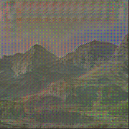

# Image Style Transfer Network

This is **Ganyu Wang (Computer Science MSc)**'s Computer Vision Final Project

Tensorflow-Keras implementation of neural style transformation network.
The original article is Perceptual Losses for Real-Time Style Transfer and Super-Resolution https://arxiv.org/abs/1603.08155

Used Intel image recognition dataset (https://www.kaggle.com/puneet6060/intel-image-classification)
instead of the Microsoft COCO dataset in google(the dataset in the paper).

The implementation is both on **Linux (project folder)** and **Google colab (standalone ipynb file)**.

<table style="width:100%">
  <tr>
    <th></th>
    <th> <font size="5"> + </font> </th>
    <th></th>
    <th> <font size="5"> = </font> </th>
    <th></th>
  </tr>

</table>


# Train the transfer network in Linux or Windows
## A) Training the transfer network
### Step 0: Environment setup

pip Requirements.txt for library package.
```
pip install -r requirements.txt
```

### Step 1: Get your Kaggle API key
Follow the Authentication section in https://www.kaggle.com/docs/api and download your API key. This key should be a file named "kaggle.json"
 

> In order to use Kaggle's public API, you must first authenticate using an API token. From the site header, click on your user profile picture, then on “My Account” from the dropdown menu. This will take you to your account settings at https://www.kaggle.com/account. Scroll down to the section of the page labelled API:

> To create a new token, click on the “Create New API Token” button. This will download a fresh authentication token onto your machine.


### Step 2: Download the Intel Image Classification dataset. 


Windows system:
Put the Kaggle key Json file in "C:/Users/{user_name}/.kaggle./"
The {user_name} is your account name for windows system.

Linux system:
Put the Kaggle key Json in "/home/{user_name}/.kaggle/"
The {user_name} is your account name for the linux system.
If you cannot cd to ".kaggle"
You may need to mkdir a directory named ".kaggle"


### Step 3: run download.py
After you run download.py, the dataset will be downloaded at this path "../intel-image-classification/". The dataset will be downloaded to the parent folder.

in Linux :
```
python download.py
```

similar in windows:
Open your Windows Powershell or CMD to "python download.py" or use your python IDE.

### Step 4: Run training procedure.
Just run train.py

in Linux:
```
python Train.py
```
in Windows:
```
python Train.py
```
### Step 5 Saved model and used for prediction. 
The trained model is saved in "model/transformation_model"

## B) Use the model for image and video style transfer. 
The python script for this part is image_video_prediction_demo.py
The test image is in the floder "test_content_image", the test video is in "test_content_video"
The transformation model is in "model/transform_model_epoch_40.h5"
The path is hard coded in image_video_prediction_demo.py
```
python image_video_prediction_demo.py
```
the transfered video and image will be generated under the floder, the names are "output.mp4" and "predict.png" respectively. 

# Train the transfer network in Google Colab

## A) training the model (NeuralStyleTransfer.ipynb)
There is a standalone ipynote book, named "NeuralStyleTransfer.ipynb" in the project folder. 
You can upload it in google colab.

### Step 0: Set your Google Colab runtime type to GPU.
Set your google colab colab runtime type to GPU. The operation is "Runtime -> Change runtime type -> GPU -> Save"

### Step 1: Download the dataset.
run the 1st cell, upload your Kaggle API key (kaggle.json).
run the 2nd cell, download the target style image, and the test image. 

### Stop 2: training and predicting
run the following cells, for training and testing.
The ipynb is self-explained with Text.

## B) Video style transfer demo (video_style_transformation.ipynb)
The video transformation demo is in the file video_style_transformation.ipynb
You can upload it to google colab and open it.
You need to upload a h5 model weight file, which is train by part A).


